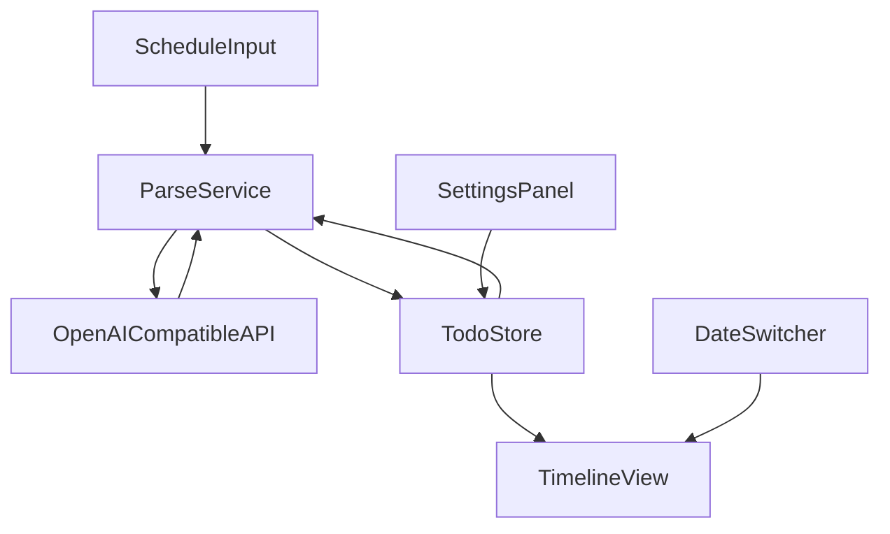

# 日程时间轴解析器

Feature Name: schedule-timeline-parser
Updated: 2026-09-17

## Description

单页 Web 应用。使用者粘贴含时间和事件的日程原文，系统调用使用者配置的 OpenAI 兼容 Chat Completions 接口，解析为短条目待办，按日期展示在时间轴上。待办与 API 配置均写入浏览器 localStorage。界面为中文，解析结果只读。

## Architecture



浏览器内完成全部交互。ParseService 使用 fetch 直连使用者填写的 Base URL。开发服务器仅用于静态资源与预览。

## Components and Interfaces

### ScheduleInput

- 多行文本框接收一次性粘贴的日程原文
- 触发解析按钮
- 解析进行中禁用重复提交，并显示中文进行中提示

### SettingsPanel

- 字段：Base URL、API Key、模型名
- 保存到 Local Store
- API Key 输入使用 password 类型

### DateSwitcher

- 默认选中本地当前日期
- 支持前一天、后一天、日期选择器

### TimelineView

- 展示所选日期的待办，按时间升序
- 每条显示时间与标题
- 无数据时显示中文空状态
- 不提供编辑、完成、删除控件

### ParseService

请求体遵循 OpenAI Chat Completions：

- `POST {baseUrl}/chat/completions`
- Header: `Authorization: Bearer {apiKey}`
- 系统提示要求输出 JSON 数组，每项含 `title`、`date`（YYYY-MM-DD）、`time`（HH:mm）
- 从模型返回的 `choices[0].message.content` 中提取 JSON

### TodoStore

- Key：`schedule-timeline.todos`、`schedule-timeline.settings`
- 同一日期的新解析结果覆盖该日期旧条目
- 其他日期条目保留

## Data Models

```text
TodoItem {
  id: string
  title: string
  date: string   // YYYY-MM-DD
  time: string   // HH:mm
}

Settings {
  baseUrl: string
  apiKey: string
  model: string
}

TodoStoreState {
  items: TodoItem[]
}
```

## Correctness Properties

- 时间轴只渲染与选中日期相同的条目
- 同一日期条目按 `time` 升序
- 解析失败时已有条目保持不变
- 空文本不发起 API 请求
- 缺少 Base URL、API Key 或模型名时不发起 API 请求

## Error Handling

| 场景 | 处理 |
|------|------|
| 文本为空 | 中文提示需要粘贴日程 |
| 配置不完整 | 中文提示补全 API 设置 |
| 网络或 HTTP 失败 | 保留旧数据，展示失败原因 |
| 模型返回无法解析的内容 | 保留旧数据，提示解析结果无效 |
| localStorage 写入失败 | 当前会话仍展示结果，并提示未能持久化 |

## Test Strategy

- 手工验证：粘贴含多日期的日程，检查覆盖规则与日期切换
- 手工验证：错误 Key、空文本、空日期的提示文案
- 手工验证：刷新页面后待办与设置仍在

## References

[^1]: OpenAI Chat Completions API
